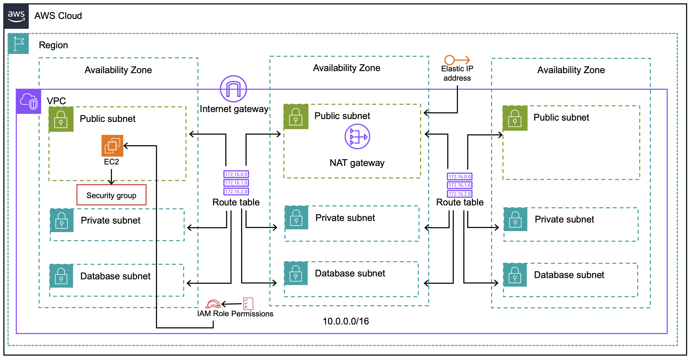

# Full Stack Web Application - Phase 5
In this section, we will learn how to build the basic Infrastructure

This phase includes

- Building Basic Infrastructure with Terraform on AWS
- Topics Covered
  - **Terraform** 
    - Concepts : Sate Management, Workspace
    - Actions : All that followed in previous Phases
  - **Cloud** : AWS
    - Network Resources such as VPC, IGW, NGW, Route, RT, Subnet, Default SG
    - Storage Resources such as S3

For terraform basic tutorial : [Terraform Tutorial](infra/terraform/README.md)
For previous phases : [Project Phases](#project-phases) 

### Architecture
Following Architecture will be built on our Infrastructure


  
## Cloud Resources 
All the infrastructure related codes are present under the folder `infra` and IaC is under `terraform`
### 0. Pre-requisites
Before making the hands dirty, there are few things to understand about terraform code such as how to find appropriate resource?, what are all the attributes need? etc
- Always refer terraform documentation for any type of resources (implemenatation may differ terraform version to version)
- Once after the `Architecture` is signed off from the customer/architect, decide on TF version for the project and startup TF project folder structure (that we learnt in `Phase - 3`)
- Below coming explanation will make you to understand , how to write your first TF project with modules.


> **Let's Get Started**

 ### 1. State
In this section we are going to learn what is `State` in terraform.

A **state** is nothing but a JSON file which contains the configuration described/applied by the terraform code.
- Terraform cannot function without a state file
- State file used by Terraform to map real world resources to the terraform code configuration.
- Terraform requires some sort of database to map Terraform config to the real world. For example, when you have a resource resource "aws_instance" "ems-demo" in your configuration, Terraform uses this mapping to know that the resource resource "aws_instance" "ems-demo" represents a real world object with the instance ID i-abcd1234 on a remote system.
- Also this state file contains the mapping, metadata such as provider versions, dependencies of the provider.
- In the default configuration, Terraform stores the state in a file in the current working directory where Terraform was run. This is okay for getting started, but when using Terraform in a team it is important for everyone to be working with the same state so that operations will be applied to the same remote objects.


#### - Remote State
In order to share a single terraform source/repo to multiple actors such more than one human using same code, more than one cicd tools uses the same code then `Remote State` concept with `Lock` is needed. `Remote State` is implemented via `backend` or Terraform cloud.

#### - Backend
`Backend` describes where the `terraform state` must be stored. By default, Terraform uses a backend called `local`, which stores state as a local file on disk.

```
terraform {
  backend "local" {
    path = "relative/path/to/terraform.tfstate"
  }
}

```
For `AWS` infra , most popularly used `backend` for the `remote` state is `S3`

#### - S3 Backend Remote State
When the remote state is chosen as `S3` then terraform considers the S3 bucket and object key as its terraform state file.

Here are staps to setup remote state with `s3`
- Create a s3 bucket named `ems-demo-tfstate` in AWS with version enabled
- Create a DynamoDB in AWS with string key as `TfLockID`
- Incase if the AWS CLI user is not having admin access and then add a new IAM Policy to allow S3 and DynamoDB permissions 
  - Policy to perform S3 Operations
```
{
  "Version": "2012-10-17",
  "Statement": [
    {
      "Effect": "Allow",
      "Action": "s3:ListBucket",
      "Resource": "arn:aws:s3:::ems-demo-tfstate"
    },
    {
      "Effect": "Allow",
      "Action": ["s3:GetObject", "s3:PutObject", "s3:DeleteObject"],
      "Resource": "arn:aws:s3:::ems-demo-tfstate/demo/dev.tfstate"
    }
  ]
}

```
  - Policy to perform DynamoDB Operations
  ```
  {
  "Version": "2012-10-17",
  "Statement": [
    {
      "Effect": "Allow",
      "Action": [
        "dynamodb:DescribeTable",
        "dynamodb:GetItem",
        "dynamodb:PutItem",
        "dynamodb:DeleteItem"
      ],
      "Resource": "arn:aws:dynamodb:*:*:table/TfLockID"
    }
  ]
}

  ```
- Add the `backend` block under the `terraform` block in `terraform.tf`
```
terraform {
  backend "s3" {
    bucket = "ems-demo-tfstate"
    key    = "demo/dev.tfstate"
    region = "us-east-1"
    dynamodb_table = "TfLockID"
  }
}

```

# That's All for Backend Config !!!

# Let us initiate the Terraform code with above changes


 ### 2. Re-Initiate, Plan Terraform Modules
In this section we are going to perform the terraform actions post `s3 backend, remote state` configuration. 

- Try the following command and observe 
  - terraform init
  - terraform plan
  - terraform apply 
    
### 3. Understand Remote State
 #### - Connect to AWS S3 and Look at the terraform state file created
 - `dev.tfstate` is the file that holds all the infrastructure details and metadata

 ### 4. Destroy All
 #### - Destroy the infrastructure
 - reun `terraform destroy` to destroy all the resources created by the terraform code.


### Project Phases
-------
1. [Phase - 0 : Full Stack App Deployment (Manually)](https://github.com/jumisa/ems-ops/tree/phase-0)
1. [Phase - 1 : Full Stack App Deployment (Daemonize)](https://github.com/jumisa/ems-ops/tree/phase-1)
1. [Phase - 2 : Infrastructure by Terraform (Basics)](https://github.com/jumisa/ems-ops/tree/phase-2)
1. [Phase - 3 : Infrastructure by Terraform (Network Resource)](https://github.com/jumisa/ems-ops/tree/phase-3)
1. [Phase - 4 : Infrastructure by Terraform (Terraform Modules)](https://github.com/jumisa/ems-ops/tree/phase-4)